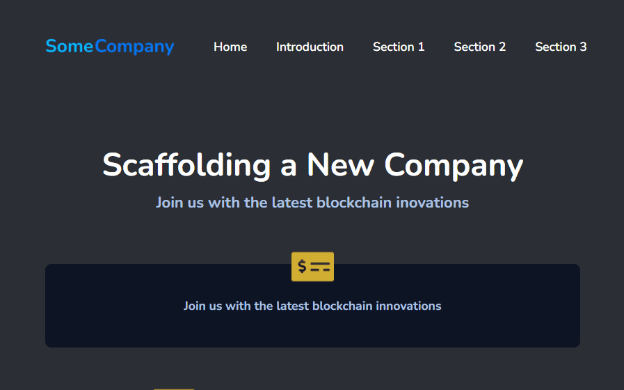

# Responsive Landing page

## Sobre o projeto
Projeto de estudo desenvolvido para o desenvolvimento de uma Landing Page Responsiva, utilizando as tecnologias HTML, CSS e Javascript, em mentorias com a supervisão de <a href="https://www.linkedin.com/in/nayra-cruz/">Nayra Cruz</a> baseado no projeto <a href="https://www.figma.com/file/TnSdpyVrQKvGAVdIgOdsdK/Responsive-Landing-Page-Mentoria-Milena">Responsive Landing Page</a>.
## Tecnologias utilizadas
* HTML
* CSS
* JavaScript
## Como baixar
## Interface
### Resolução Mobile

### Resolução Tablet 

### Resolução Desktop

## Créditos
<a href="https://www.linkedin.com/in/nayra-cruz/">Nayra Cruz</a>